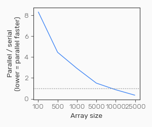

As a fanatical Python enthusiast, I have frequently tried to convert Matlab users to my preferred language. Alongside common complaints such as _"Please stop bothering me"_ and _"Why do you keep going on about this"_, one that I've heard a few times is _"Yeah Python seems great, but it's so slow"_. 

Sadly, this is correct - Python is [slow](https://medium.com/swlh/a-performance-comparison-between-c-java-and-python-df3890545f6d) compared to other languages, including Matlab. While arguably it makes up for this in [other ways](https://medium.com/pyslackers/yes-python-is-slow-and-i-dont-care-13763980b5a1), speed is still important for many tasks. 

One obvious way to speed up computation in any language is to use your computer's full processing power for the task, using parallel processing to use more than just a single core to rapidly decrease computation times. However, parallelisation in Python is not necessarily straightforward. Another avenue is to translate Python code to faster C code, however this can also be tricky.

This is something I've spent a fair bit of time messing around with, and while I am by no means an expert I thought it might be helpful to write down what I've learnt, both for my future self and others out there who might want to speed up their Python code. This won't cover parallel processing on clusters, the focus here is on single-machine parallelisation.

## Background on parallel processing

Parallel processing essentially involves breaking a big job into chunks, sending each chunk to a single CPU core to run, and then collecting the results. This can be useful, for example, if you have a big for loop. Say you need to loop through 10 items and run some intensive processing on each one, taking ~60 seconds. One option would be to run through item by item in serial, which would take around 10 minutes. Alternatively, if you have 10 CPU cores, you could send each iteration to a separate core and have them all run at once. This would get the same job done in about 1 minute, giving you a 10x speedup (the speedup isn't always this clear in reality, more on that later).

### Basic principles

There are a few important things to consider when trying to parallelise any code. 

#### Beware of "race conditions"

Sometimes you might want to iteratively run code that modifies a shared variable. For example, say you have some value you want to update on each iteration:

``` python {linenos=table,linenostart=1}
value = 1

for i in range(100):
    value += i
    do_something(value)
```

Running this in serial is straightforward - each iteration will run `do_something()` with a value of `value` that is `i` greater than the previous iteration. However, in parallel this could cause problems - if dispatched to different CPU cores, each process is not gauranteed to finish in the same order it would if run in serial. In this toy example, this could mean that `do_something()` is being run with a `value` that is different to what it would be if run in serial. This might not necessarily be a problem, it'll depend on the use.




#### The costs of parallisation

Running processing in parallel is rarely free. The process of dispatching a process to execute the code and transferring the necessary data to that process takes time (known as __overhead__) - this will sometimes be a bigger issue if there is more data involved which needs to be transferred to each new parallel process. This results in a fairly important rule for running analyses in parallel: 

__Do not parallelise small chunks of processing__. 

The reason for this is that the costs of executing code in parallel stay relatively constant regardless of the computational requirements of the code itself. For example, say the cost of executing a single chunck of code in parallel (in terms of the startup/data transfer cost) is 2 seconds. Going back to our earlier example of a process that takes 60 seconds, this means that each of the 10 processes will cost an extra 2 seconds relative to running the code in serial. This is still a great speedup - it'll now be 62 seconds rather than 10 minutes. 

However if our processing is pretty fast, say 0.5 seconds rather than 60 seconds, things change. We still have the 2 second parallelisation cost, so each process takes 2.5 seconds to run, compared to 0.5 seconds in serial. Therefore the time taken for a parallel version is 2.5 seconds, compared to 5 seconds (10 x 0.5 seconds) for the serial version. It's still a speedup, but it's nowhere near as big a speedup as we get with the more time-consuming process.

In practice, this means that if for example you want to process data for 10 subjects, it's generally better to process each subject in its entirety within a separate process, rather than for example running each individual processing step in parallel. 

#### Memory can be a limiting factor

Even if your computer has 64 cores, this doesn't necessarily mean you'll have the capacity to process 64 things at once. It's important to bear in mind the fact that your memory usage will often increase in line with the number of parallel processes you're running. For example, if you're processing multiple subjects in serial, you only need to load one subject's data into memory at a time. In contrast, if you're running 64 at once, this means you'll need to load 64 subjects' data in at once! One subject might be 10GB if you're dealing with neuroimaging data, however 64 subjects is going to need 640GB which you're unlikely to have access to. There are ways around this for certain situations (such as using Numpy's [memmapping](https://joblib.readthedocs.io/en/latest/auto_examples/parallel_memmap.html)), however there's no way to avoid this limitation entirely.

### Implementing parallel processing in Python

There are a range of parallel processing packages available for Python. It even comes with one built-in, called `multiprocessing`. In my experience, I've generally found `multiprocessing` to be fairly powerful but also a little awkward to work with. I will therefore focus on the one I tend to use the most.

### Joblib parallelisation

[Joblib](https://joblib.readthedocs.io/en/latest/) does a few things, one of which is implementing straightforward parallel processing. Joblib has thorough [documentation](https://joblib.readthedocs.io/en/latest/parallel.html), so I'll just cover the basics here.

The idea of the parallel methods in Joblib is to take a list of items that will be processed, split it into chunks, and then run the processing on each one. One nice feature of Joblib's functions is that it maintains the order of its inputs, so you avoid them coming back in a different order than the one in which they were sent.

The Joblib interface is based around the `Parallel` and `delayed` functions. The `Parallel` function enables your custom function to be run in parallel. The `delayed` function might seem a little confusing - essentially all this does is tell Python to hold off on running the requested code until it's able to do it in one of the parallel processes. 

This means you end up with something like:

``` python {linenos=table,linenostart=1}
from joblib import Parallel, delayed

def example_func(X):
    return np.sqrt(X)

Parallel(n_jobs=6)(delayed(example_func)(i) for i in np.arange(100))
```

This would return the square root of every item between 0 and 100. This syntax might look a little strange, so let's break down what this is doing a little:

``` python {linenos=table,linenostart=1}
def example_func(X):
    return np.sqrt(X)
```

This is the function we want to run on every item in a list in parallel.

```python 
Parallel(n_jobs=6)
```

This function call tells Python that we want to run something in parallel, and that we want it split across 6 different processes (this should be at most the number of CPUs your system has access to.)

```python 
(delayed(example_func)(i) for i in np.arange(100))
```

This is a list comprehension (i.e. `(function(item) for item in list`). 

For each item in the list (for each `i` in `np.arange(100)`), we are doing:

``` python
delayed(example_func)(i)
```

This is first using `delayed(example_func)` to create a "delayed execution" version of our example function (as mentioned earlier, this just ensures it is run by the parallel process, rather than being run immediately). Adding `(i)` is then just calling this function with everything in brackets as its arguments, in this case it's just `i` that we're feeding in.

Using this simple method, it's easy to run things in parallel without having to mess around with manually setting up pools of workers etc., as is necessary when using `multiprocessing`. This basic workflow can be extended to support more complicated requirements, e.g. shared memory, as described in the [documentation](https://joblib.readthedocs.io/en/latest/parallel.html)

## Optimising Python for speed

You don't necessarily need to run you code in parallel to achieve significant speedups. If you're manipulating data in the form of NumPy arrays, there are a couple of other methods that can be effective.

### Vectorisation

I won't go into detail on this because it's a fairly fundamental aspect of NumPy that is covered extensively [elsewhere](https://learning.oreilly.com/library/view/python-for-data/9781449323592/ch04.html). 

Essentially, `for` loops should be avoided when manipulating NumPy arrays. Instead, vectorised operations should be used. As an example, say you want to sum the elements of two columns in an array, you could do it like this:

``` python {linenos=table,linenostart=1}
x = np.random.randn(20, 2)
sums = []
for i in range(x.shape[0]):
    sums.append(x[i, 0] + x[i, 1])
```

This approach of looping over every element is _slow_ and should be avoided. Instead, you can use vectorized operations, for example:

``` python
sums = np.sum(x, axis=1)
```

This vectorises the `sum` operation across the desired axis. Rather than summing each element individaully, it magically does the whole thing at once through clever methods that I do not understand. The effect is that this is MUCH faster - as shown below.

``` python {linenos=table,linenostart=1}
X = np.random.randn(200000, 2)

%timeit slow_sum(X)
116 ms ± 3.81 ms per loop (mean ± std. dev. of 7 runs, 10 loops each)

%timeit fast_sum(X)
3.23 ms ± 214 µs per loop (mean ± std. dev. of 7 runs, 100 loops each)
```

### Numba

Even when taking full advantage of Numpy's capabilities, it's not always possible to achieve the same speed as other languages. It's also not always possible to vectorise operations fully, meaning you'll be reliant on `for` loops, which (as shown above) are _very_ slow in Python.

The reason for Python's speed is that it's a dynamically-typed, interactive language. This contrasts with other languages (e.g. C++). These are typically compiled rather than dynamic - this means that rather than being interpreted and run on the fly, the code is compiled to machine code (very low-level functions) in advance. This means there isn't an interpeter having to figure out what to do on every line, speeding things up massively. These languages also generally use static typing. In Python, you don't need to define the type of your variables. For example:

``` python {linenos=table,linenostart=1}
a = 1
b = 2.5
c = "hello"
```

Python will figure out that `a` is an `int`, `b` is a `float`, and `c` is a `str` for you. In other languages, you can't do this - you need to tell the compiler what type each variable is (and depending on the language perhaps other properties, such as whether a number will be positive or negative). This means that Python has to constantly figure out what type a variable is, slowing things down.

To get around this, packages have been developed that translate your Python code to a faster language (generally C++), allowing you to use this accelerated implementation instead of the pure Python version. One that I've used a lot for array-based processing is [Numba](https://numba.pydata.org/). Numba essentially implements Numpy's functionality, but compiles the code you write to C++ when it is run, speeding things up substantially.

Numba uses "just in time" compilation - that is, it compiles the functions when they're run. This is implemented using decorators `@jit` and `@njit`. For example:

``` python {linenos=table,linenostart=1}
# Pure python
def do_something(X, Y):
    return X + np.exp(Y)

# Numba version
@njit
def do_something(X):
    return X + np.exp(Y)
```

The code in the function itself doesn't necessarily change (although it will sometimes have to), it just gets compiled to a faster language. 

One important thing to know when using Numba is that it's normally best to avoid using `@jit` and use `@njit` instead. The `@njit` decorator does not allow any code within the function to run as pure Python code, whereas the `@jit` decorator will compile the lines it is able to and leave the rest as pure Python - this means it might end up jumping between optimised and non-optimised code, delivering no speedup whatsoever.

Here's an example of the speedup that can be achieved:

``` python {linenos=table,linenostart=1}
from numba import njit

X = np.random.randn(500)
Y = np.random.randn(500)

def example_func_python(X, Y):
    out = []
    for a in range(X.shape[0]):
        results = np.zeros(6)
        for b in range(6):
            results[b] = np.dot(np.ones(X.shape[0]), Y + 0.8*X)
        out.append(results)                   
    return out

@njit
def example_func_numba(X, Y):
    out = []
    for a in range(X.shape[0]):
        results = np.zeros(6)
        for b in range(6):
            results[b] = np.dot(np.ones(X.shape[0]), Y + 0.8*X)
        out.append(results)                   
    return out

```
``` python {linenos=table,linenostart=1}
%timeit example_func_python(X, Y)

20.8 ms ± 886 µs per loop (mean ± std. dev. of 7 runs, 10 loops each)

%timeit example_func_numba(X, Y)

2.11 ms ± 132 µs per loop (mean ± std. dev. of 7 runs, 1 loop each)
```

That's a roughly 10x speedup, without any changes to the code except the addition of the `@njit` decorator (if you try this yourself, it's worth noting that the first time you run any `@njit`ed function it'll be slightly slower due to the intiial compilation).

One thing you might notice is that there are a lot of `for` loops going on here. __This is the kind of thing that Numba really helps with__. While `for` loops are slow in pure Python, they're super fast in Numba's optimised code. While you can often vectorise operations in Numpy, sometimes there's no way to avoid looping, and this is where Numba really speeds things up.

### Parallelisation within Numba

Numba also provides the ability to parallelise the optimised code, without the need to mess with any additional packages. This is achieved by simply using `@njit(parallel=True)` and changing any `range()` function used for looping to Numba's `prange()` function.

However, in reality this is often not massively useful because of the costs to parallelisation mentioned above. Numba will be parallelising very small chunks of code, and so the performance gain isn't as great as you might hope. For example:

``` python {linenos=table,linenostart=1}
from numba import njit, prange

@njit(parallel=True)
def example_func_numba(X, Y):
    out = []
    for a in range(X.shape[0]):
        results = np.zeros(6)
        for b in prange(6):  # <<<PARALLEL LOOP
            results[b] = np.dot(np.ones(X.shape[0]), Y + 0.8*X)
        out.append(results)                   
    return out
```

Here I've asked one of the for loops to run in parallel - this is looping over 6 values, so in principle (assuming we have at least 6 cores), we should see a 6x speedup. However this isn't what we get in practice:

<!--  -->
<p align="center">
  
</p>


With smaller array sizes, the parallel version is over 8x _slower_ than the serial version. It's only when we get to fairly large arrays that the parallel version overtakes the serial version. 

So why is this? With less data, the line that is being parallelised (`results[b] = np.dot(np.ones(X.shape[0]), Y + 0.8*X)`) is not particularly computationally expensive, becoming much more demanding as the array size increases. With a small array, we're spending a lot of time on the setting up of the parallel execution, but very little time running the code, so it ends up making things slower. As the cost of the computation itself increases, the cost of the parallelisation becomes relatively small in comparison, and parallel processing starts to make things faster. 


## Things to be aware of

There are a few things that you should be aware of when implementing parallel processing in Python.

### Pickling

Certain parallel processing packages (such as the built-in `multiprocessing` one) require functions to be [pickleable](https://docs.python.org/3/library/pickle.html) (i.e. serialised) in order to be parallelised. This can be difficult with certain functions.

### Using parallel operations on Windows

Most parallel operations will typically not work within the context of an interactive session on Windows (this generally isn't a problem on Linux/Mac OS). This is a little annoying, and the only way to get parallel operations working on Windows is to ensure your code is within the `__main__` block within a script. More info on this is available [here](https://stackoverflow.com/questions/20222534/python-multiprocessing-on-windows-if-name-main).


### Inbuilt parallel operations

Some NumPy functions are pre-optimised, using fast C++ routines to perform calculations (for example matrix multiplication). Depending on the libraries you've got NumPy linked to, and the way your system is set up, these might be parallelising their calculations without you knowing. 

Unfortunately, this can interfere with your own attempts to set up parallel workflows, as I have found out (after spending about a day trying to figure out why my beautiful, optimised, parallelised code wasn't running any faster). You might, for example, have 4 cores available so you split your processing into 4 streams, each of which is run in a separate process. However, each processing stream involves matrix multiplication, and NumPy itself then tries to use all the 4 cores on your system to run this. So you have 4 processes, each of which is trying to itself use the 4 available cores. This ends up making a mess of everything. Adding the following (or a subset of it, depending on the libraries you're using) __before__ importing NumPy will ensure that it only tries to use a single core:

``` python {linenos=table,linenostart=1}
import os
os.environ["MKL_NUM_THREADS"] = "1" 
os.environ["NUMEXPR_NUM_THREADS"] = "1" 
os.environ["OPENBLAS_NUM_THREADS"] = "1"
os.environ["OMP_NUM_THREADS"] = "1" 
```

### Other frameworks for speeding up Python code

I've only covered a limited number of available frameworks here. There are a multitude of others available about there for optimisation (e.g. Cython), converting numpy functions to compiled computational graphs (e.g. Jax), and advanced parallel processing (e.g. Dask).

Thanks for reading, and I hope this might help someone make their code a little faster!